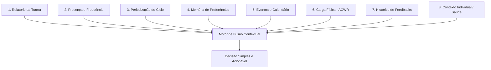

# Pilares da Inteligência Artificial (Copiloto Pedagógico)

Este documento centraliza a arquitetura conceitual e técnica da Inteligência Artificial do **GoAtleta**. Ele orienta o comportamento das LLMs (como GPT-4o-mini no assistente), a estruturação de prompts e o motor de regras científicas do sistema, servindo como guia canônico para que o sistema de IA mantenha a consistência pedagógica e operacional.

---

## ⚡ Princípio da Compressão Cognitiva
O assistente de IA opera sob o **Princípio da Compressão Cognitiva**:
* **Objetivo**: Absorver a complexidade de múltiplos inputs (scouting, presença, carga física, periodização) e fornecer uma **decisão final simples, clara e acionável** para o treinador.
* **Instrução fundamental**: A IA diz o **O QUE fazer** (ex: *\"Evite saltos para o João hoje\"* ou *\"A quadra está molhada, reduza o volume\"*), e não como ela calculou isso. Detalhes de RAG, tabelas Supabase ou metadados de sistema nunca devem ser expostos na interface do usuário.

---

## 🏛️ Os 8 Pilares da Fusão Contextual
O gerador de planos e o assistente analisam 8 fontes de dados integradas para formular recomendações. O contexto individual dos alunos é o pilar final (Pilar 8), que consolida a análise.

### Detalhamento dos Pilares:
1. **Relatório da Turma**: Sinais qualitativos preenchidos pós-treino (fadiga, foco, aproveitamento). Funciona como evidência em tempo real, mas nunca de forma isolada.
2. **Presença e Frequência**: Histórico de presença e controle de alunos em aula experimental (necessitando de integração amigável ou acolhimento diferenciado).
3. **Periodização do Ciclo**: O momento pedagógico do planejamento trimestral/mensal (ex: fundamentos, consolidação, especialização, competição). A IA orienta dentro do ciclo definido, sem sobrescrever o plano do professor.
4. **Memória de Preferências (FACTS_MEMORY)**: Fatos persistidos na tabela `ai_facts` sobre a turma, alunos (habilidades específicas) ou preferências do treinador.
5. **Eventos e Calendário**: Proximidade de festivais, jogos de campeonato ou folgas que alterem a intensidade do microciclo.
6. **Carga Física (ACWR)**: Controle preventivo baseado na relação de carga aguda/crônica e no volume/intensidade das sessões anteriores.
7. **Histórico de Feedbacks**: Registro de aceitação das sugestões da IA (sugestões aceitas, modificadas ou ignoradas) para que o assistente se adapte ao estilo do treinador.
8. **Contexto Individual (Saúde/Liberações)**: Histórico de anamnese, pendências de liberação médica e particularidades físicas de cada atleta (ex: dor no joelho, restrição de impacto).
   * *Referência técnica*: [supabase/functions/assistant/index.ts#L1112](file:///c:/Users/gusta/Downloads/GoAtleta/supabase/functions/assistant/index.ts#L1112)

---

## 🔬 As 5 Dimensões Pedagógicas (Pilares Científicos)
A IA orienta a construção de exercícios do catálogo pedagógico baseando-se em 5 dimensões com fundamentação científica em aprendizagem motora (2020+):

| Dimensão | Níveis | Foco Científico | Fonte de Referência |
| :--- | :--- | :--- | :--- |
| **1. Variability** | Baixa (Blocked) \| Média (Variable) \| Alta (Random) | Variabilidade das repetições e contextos | Schmidt & Lee (2020) - Contextual Interference Effect |
| **2. Representativeness** | Baixa (Isolated) \| Média (Semi-Realistic) \| Alta (Game-Realistic) | Proximidade do exercício com o jogo real | Abordagem de Dinâmica Ecológica (Davids et al.) |
| **3. Decision-Making (Autonomy)** | Baixa (Coach-Directed) \| Média (Guided) \| Alta (Autonomy) | Nível de tomada de decisão tática pelo aluno | Constraint-Led Approach (Renshaw et al., 2016) |
| **4. Task Complexity** | Baixa (Simple) \| Média (Moderate) \| Alta (Complex) | Demandas coordenadas e cognitivas do exercício | Fitts & Posner (1967) / Modelo de Newell (1986) |
| **5. Feedback Frequency** | Baixa (Low) \| Média (Moderate) \| Alta (High) | Frequência de intervenção e correção do coach | Guidance Hypothesis (Schmidt & Lee, 2020) |

* *Referência técnica*: [src/config/pedagogical-dimensions.json](file:///c:/Users/gusta/Downloads/GoAtleta/src/config/pedagogical-dimensions.json) e [docs/PEDAGOGICAL_DIMENSIONS_SYSTEM.md](file:///c:/Users/gusta/Downloads/GoAtleta/docs/PEDAGOGICAL_DIMENSIONS_SYSTEM.md)

---

## 🛡️ Camada de Governança e Restrições Científicas
Para evitar que a IA tome decisões que coloquem a integridade física ou pedagógica dos alunos em risco, existe uma camada rígida de governança baseada em regras de banco:
* **Restrições de Carga**: Se o aumento simulado de carga violar o limite seguro (ex: > 15%), a IA dispara um warning.
* **Restrições de Faixa Etária**: Regras de segurança específicas para categorias menores (ex: Sub-11 não deve ter treinos com foco excessivo em bloqueio formal ou carga excêntrica extrema).
* **Diretriz de warnings**: Se um limite for violado, a IA é obrigada a incluir alertas pedagógicos claros e sugerir rotas alternativas.

* *Referência técnica*: [supabase/functions/_shared/ai-governance.ts](file:///c:/Users/gusta/Downloads/GoAtleta/supabase/functions/_shared/ai-governance.ts)

---

## 📂 Estrutura de Arquivos da IA
Para fins de manutenção e futuras evoluções, os principais arquivos relacionados à IA estão divididos assim:

* **Configurações e Definições**:
  * [src/config/pedagogical-dimensions.json](file:///c:/Users/gusta/Downloads/GoAtleta/src/config/pedagogical-dimensions.json) (Matriz pedagógica)
  * [src/core/pedagogical-dimensions-types.ts](file:///c:/Users/gusta/Downloads/GoAtleta/src/core/pedagogical-dimensions-types.ts) (Tipos e interfaces da matriz)
* **Lógica no App (Frontend/Core)**:
  * [src/core/pedagogical-dimensions.ts](file:///c:/Users/gusta/Downloads/GoAtleta/src/core/pedagogical-dimensions.ts) (Lógica de derivação e refinamento)
  * [src/copilot/](file:///c:/Users/gusta/Downloads/GoAtleta/src/copilot/) (Provedores e interface de chat do Copiloto no app)
* **Lógica no Supabase (Backend/Comunicações)**:
  * [supabase/functions/assistant/index.ts](file:///c:/Users/gusta/Downloads/GoAtleta/supabase/functions/assistant/index.ts) (Ponto de entrada do assistente LLM e payloads de prompt)
  * [supabase/functions/_shared/ai-memory.ts](file:///c:/Users/gusta/Downloads/GoAtleta/supabase/functions/_shared/ai-memory.ts) (Resolução e injeção do histórico/fatos no prompt)
  * [supabase/functions/_shared/ai-governance.ts](file:///c:/Users/gusta/Downloads/GoAtleta/supabase/functions/_shared/ai-governance.ts) (Barreiras e avisos de segurança da IA)
  * [supabase/functions/_shared/ai-periodization-context.ts](file:///c:/Users/gusta/Downloads/GoAtleta/supabase/functions/_shared/ai-periodization-context.ts) (Integração com a periodização esportiva)

---

## Workspace como escopo organizacional

O GoAtleta possui **um único motor de fusão contextual**. Workspace não representa
outra IA: representa a organização ativa por meio de `organization_id`. O usuário é
global, mas todo contexto pedagógico e operacional é carregado a partir do workspace
ativo.

### Regras obrigatórias

1. Toda chamada ao assistente deve enviar explicitamente `organizationId`.
2. O backend valida se o usuário pertence à organização informada e nunca escolhe a
   primeira associação como fallback.
3. Quando houver `classId`, a turma também deve pertencer à mesma organização.
4. Relatórios, presença, calendário, planejamento, periodização, memória contextual,
   decisões, notificações e fontes institucionais não atravessam workspaces.
5. A troca de workspace invalida a visualização e o cache contextual anteriores.

O contrato compartilhado fica em
`src/core/ai-workspace-context.ts`; a barreira do backend fica em
`supabase/functions/_shared/ai-workspace-scope.ts`.

O perfil institucional persistido fica em `organization_ai_profiles`. O motor
normaliza os pesos dos pilares entre `0,5` e `1,5` e aplica uma regra invariável:
os pesos alteram a ênfase e a linguagem, mas nunca substituem evidências,
governança, prontidão ou restrições de saúde.

### Níveis de memória

| Escopo | Pode atravessar workspace? | Exemplos |
| --- | --- | --- |
| `user_global` | Sim | linguagem direta e preferências gerais do professor |
| `workspace` | Não | prioridades, calendário e regras institucionais |
| `class` | Não | etapa do ciclo, dificuldade e comportamento recente |
| `student` | Não | evolução, frequência e restrições individuais autorizadas |

Preferências `user_global` são armazenadas separadamente em
`ai_user_global_facts`, com RLS vinculada diretamente ao usuário. Memória
operacional continua em `ai_facts` e exige `organization_id`, evitando que uma
consulta global recupere dados de turma, participante ou instituição.

### Perfil institucional

O perfil do workspace pode ponderar os oito pilares de forma diferente sem trocar o
motor e sem eliminar dimensões pedagógicas. Um projeto social pode priorizar
participação, cooperação e contexto sociocultural; uma escola esportiva pode dar maior
peso à aprendizagem técnica e à progressão. A decisão continua baseada em evidências,
governança e prontidão, e a interface mostra apenas a orientação operacional.
