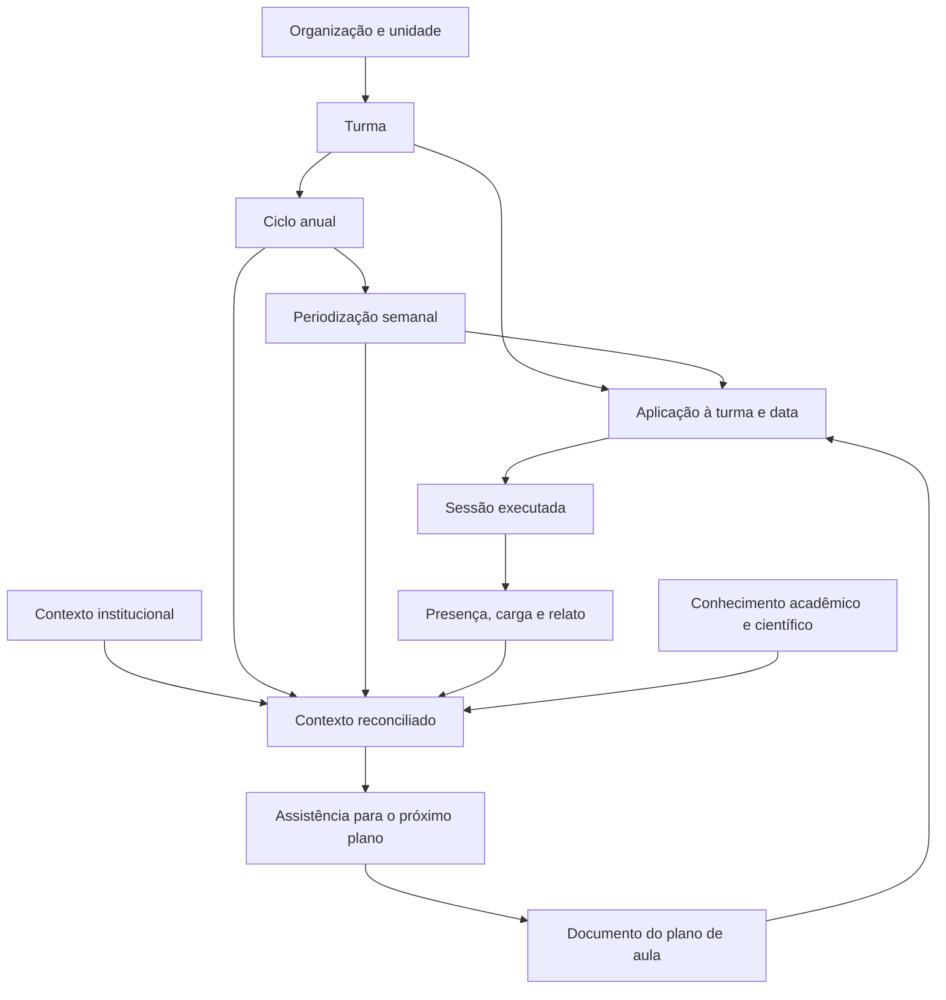

# Planejamento, periodização e contexto

O GoAtleta trata o plano de aula como um documento versionado. A turma e a data
são vinculadas somente quando o professor decide aplicar esse documento.

## Fontes de verdade

| Camada | Fonte | Responsabilidade |
| --- | --- | --- |
| Organização | `organizations`, `units`, `classes` | Define o workspace e a identidade da turma. |
| Ciclo | `planning_cycles` | Um ciclo por turma e ano. |
| Periodização | `class_plans` | Uma semana por ciclo; objetivos, fase e carga planejada. |
| Documento | `training_plans` | Conteúdo e versões do plano de aula. |
| Aplicação | `training_plan_applications` | Decisão explícita de usar uma versão em uma turma/data. |
| Execução | `training_sessions`, presença e relatos | O que realmente aconteceu na aula. |
| Contexto | reconciliação documental e memória pedagógica | Combina confirmado, realizado, institucional e conhecimento curado. |

## Regras operacionais

1. Importar ou escrever um plano não altera uma turma.
2. Aplicar à turma cria um vínculo explícito e auditável.
3. A periodização orienta a aula, mas não substitui o documento nem a execução.
4. O realizado tem prioridade sobre hipóteses ao gerar o próximo plano.
5. Turmas com o mesmo nome continuam entidades distintas e são desambiguadas
   somente onde necessário por gênero.
6. Toda semana pertence a exatamente um ciclo da mesma turma e organização.
