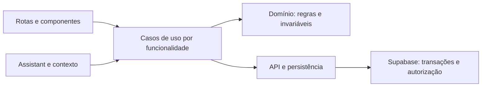

# Auditoria de código e arquitetura — GoAtleta

Data: 05/09/2026. Base: `8f8810db`, branch `main`. `origin/main` local aponta para o mesmo commit; não foi feita consulta de deploy nem confirmação de produção.

## Diagnóstico

O app tem fronteiras arquiteturais úteis e um domínio já bastante extraído, mas a concentração de estado e as migrações incompletas entre implementações estão causando defeitos funcionais. O problema prioritário é a falta de contratos únicos para sessão, cache, fila, salvamento de chamada, seleção de plano e processamento financeiro.

A recomendação é corrigir esses contratos em pacotes pequenos e, em seguida, remover os caminhos antigos. Uma reorganização ampla de pastas teria pouco efeito sobre os defeitos demonstrados nesta auditoria.

Foram registrados **21 achados: 11 P1 e 10 P2**, além das dívidas estruturais e pendências de produto abaixo. P1 significa priorizar a correção por risco de identidade, privacidade, perda de trabalho ou resultado financeiro incorreto. P2 significa corrigir em sequência por inconsistência funcional ou fragilidade de manutenção. Esses níveis não significam que houve exploração ou incidente em produção.

## Cobertura e método

- Mapeamento automatizado de **896 módulos de runtime**, **3.555 imports internos** e **262.194 linhas físicas**, incluindo linhas em branco, comentários e dados em código.
- Inventário de **172 migrações**, **37 entradas de Edge Functions** e **401 arquivos de teste rastreados**. São contagens, não alegação de leitura manual integral de todos esses arquivos.
- Revisão encadeada de autenticação, papéis, organização, cache, filas, chamada, planejamento, periodização, Assistant, fotos, família, mensalidades, Asaas, LGPD, scripts e CI.
- Execução de 400 suites Jest, typecheck do app, arquitetura, performance, escopo, configuração JWT, lint, auditoria de dependências e build web.
- Reproduções com código real carregado/transpilado e dependências de rede, banco e armazenamento simuladas. Os dados usados nos cenários são sintéticos.
- Leitura da tarefa referenciada **“Continue acesso familiar e finanças”** e confronto com o código atual. Histórico e memória serviram como contexto; achados e métricas foram verificados no checkout.

Não foram realizados smoke autenticado no navegador, validação em dispositivo físico, consultas ou mutações no banco remoto, inspeção de telemetria remota ou conferência das migrações efetivamente aplicadas. A revisão documental/IA foi parcial: contratos de contexto e integração com planejamento foram inspecionados; o arco completo de ingestão, interpretação e aplicação documental não recebeu teste de ponta a ponta.

## Achados prioritários

### F01 — P1 — Refresh atrasado pode restaurar a conta anterior

**Fonte:** [src/auth/session.ts:297](C:/Users/gusta/Downloads/GoAtleta/src/auth/session.ts:297), conclusão em [linha 338](C:/Users/gusta/Downloads/GoAtleta/src/auth/session.ts:338).

`refreshSession()` guarda a sessão inicial, aguarda a rede e persiste o resultado sem conferir se a identidade mudou durante a espera. Uma resposta de revogação antiga também chama `saveSession(null)` na linha 323.

**Reprodução:** iniciar refresh de A, fazer logout, entrar como B e liberar a resposta de A. O usuário em memória e no armazenamento passa novamente a A. O token da camada REST pode divergir do estado apresentado pelo AuthProvider.

**Correção:** geração/versão de sessão, descarte de respostas obsoletas e compartilhamento do refresh apenas dentro da mesma identidade. Login, logout e troca de conta precisam invalidar a geração anterior. **Aceite:** respostas de sucesso e revogação de A nunca substituem nem limpam B.

### F02 — P1 — Cache local reaproveita dados de outro usuário

**Fontes:** [classes.ts:40](C:/Users/gusta/Downloads/GoAtleta/src/db/classes.ts:40), [fallback de turmas:286](C:/Users/gusta/Downloads/GoAtleta/src/db/classes.ts:286), [alunos:979](C:/Users/gusta/Downloads/GoAtleta/src/db/students.ts:979), [limpeza:258](C:/Users/gusta/Downloads/GoAtleta/src/db/client.ts:258).

As chaves de turmas/alunos incluem a organização, mas não a identidade ou a versão de permissões. A limpeza remove os nomes-base e deixa as chaves com sufixo de organização. O fallback pode ser usado também após erro de autenticação.

**Reprodução:** administrador A deixa uma turma restrita no cache, a limpeza é chamada, e professor B entra offline na mesma organização. `getClasses()` devolve a turma de A. O padrão de alunos também conserva dados pessoais e de saúde. Isso demonstra exposição **local**; não demonstra bypass remoto de RLS.

**Correção:** namespace por usuário e organização, invalidação completa das chaves e política explícita para revogação/troca de acesso. **Aceite:** B nunca lê o cache de A; falha de autenticação não restaura dados sem revalidar o direito de acesso.

### F03 — P1 — Fila offline perde a identidade e a organização de origem

**Fontes:** [enfileiramento de sessão:194](C:/Users/gusta/Downloads/GoAtleta/src/db/session.ts:194), [scouting:413](C:/Users/gusta/Downloads/GoAtleta/src/db/session.ts:413), [chamada:2182](C:/Users/gusta/Downloads/GoAtleta/src/db/students.ts:2182), [processamento:439](C:/Users/gusta/Downloads/GoAtleta/src/db/nfc-sync.ts:439).

A fila global não guarda o usuário. Operações de sessão, scouting e chamada também não preservam obrigatoriamente a organização. O processamento usa a sessão e a organização ativas naquele momento.

**Reprodução:** uma escrita de A/org-A/class-A é submetida como B/org-B/class-A depois da troca de identidade. O teste confirma a submissão incorreta; aceitação remota depende das políticas e constraints e não foi testada. Na mesma organização, um usuário com autoridade maior pode enviar o trabalho pendente de outro.

**Correção:** envelope obrigatório com usuário, organização, entidade, versão e chave de idempotência; processamento por identidade; cancelamento de execução obsoleta. Preservar o trabalho pendente para o autor original. **Aceite:** trocar conta ou organização durante o flush não muda o autor nem o destino de uma operação.

### F04 — P1 — Salvar chamada pode apagar os registros anteriores antes de falhar

**Fontes:** [DELETE:2126](C:/Users/gusta/Downloads/GoAtleta/src/db/students.ts:2126), [POST:2152](C:/Users/gusta/Downloads/GoAtleta/src/db/students.ts:2152).

`saveAttendanceRecords()` apaga a chamada inteira da turma/data e insere a substituição em outra requisição. Não há transação entre as duas operações.

**Reprodução:** DELETE concluído, POST rejeitado com HTTP 400; nenhuma presença permanece. O caminho de recuperação só enfileira erros classificados como rede. Restrições de dados ou autorização podem deixar a chamada apagada enquanto a tela apenas informa falha.

**Correção:** RPC transacional que valide identidade, organização, turma, data e registros antes da substituição. Acrescentar proteção contra gravações concorrentes e idempotência. **Aceite:** qualquer falha conserva a chamada anterior integralmente; a operação bem-sucedida confirma a nova versão.

### F05 — P1 — Respostas privadas são anexadas explicitamente à telemetria

**Fontes:** [resumo do corpo:29](C:/Users/gusta/Downloads/GoAtleta/src/db/client.ts:29), [breadcrumb:186](C:/Users/gusta/Downloads/GoAtleta/src/db/client.ts:186), [filtros Sentry:93](C:/Users/gusta/Downloads/GoAtleta/app/_layout.tsx:93).

O cliente anexa os primeiros 280 caracteres da resposta ao breadcrumb, inclusive em HTTP 200. Também registra o caminho completo da requisição. O filtro global específico de `/staff-invite` não cobre os demais fluxos.

**Reprodução:** uma leitura sintética de alunos adicionou nome, telefone e observação de saúde ao campo `response`. Foi confirmada a construção do evento no SDK simulado; não se inspecionou o que efetivamente foi enviado ao Sentry remoto.

**Correção:** lista permitida de metadados — método, nome normalizado do endpoint, status, duração e código seguro de erro. Excluir corpo de sucesso e valores sensíveis da query. **Aceite:** respostas e URLs sintéticas contendo dados privados não aparecem nos eventos produzidos.

### F06 — P1 — Processamento de exclusão LGPD usa schema divergente e fica preso

**Fontes:** [seleção pending:39](C:/Users/gusta/Downloads/GoAtleta/supabase/functions/lgpd-process-dsr/index.ts:39), [lock:55](C:/Users/gusta/Downloads/GoAtleta/supabase/functions/lgpd-process-dsr/index.ts:55), [colunas:78](C:/Users/gusta/Downloads/GoAtleta/supabase/functions/lgpd-process-dsr/index.ts:78), [catch:143](C:/Users/gusta/Downloads/GoAtleta/supabase/functions/lgpd-process-dsr/index.ts:143).

A função usa `students.student_photo` e `student_cpf_masked_hmac`, ausentes das migrações do repositório. A coluna de foto é `photo_url`, definida em [20260209_add_student_photo.sql:2](C:/Users/gusta/Downloads/GoAtleta/supabase/migrations/20260209_add_student_photo.sql:2). A atualização de scouting usa outros nomes divergentes e ignora seu erro.

Antes da falha, o pedido muda de `pending` para `processing`. O catch só registra log; as próximas execuções buscam exclusivamente `pending`.

**Reprodução:** erro sintético de schema após o lock deixa o pedido em `processing`. Duas execuções retornam `{status: "ok", processed: 0}`. A ocorrência operacional depende de a função estar implantada e sendo chamada; isso não foi confirmado remotamente.

**Correção:** alinhar a projeção ao schema canônico e definir estados de falha, repetição controlada e recuperação de execução interrompida. Conferir todos os resultados secundários antes de marcar conclusão. **Aceite:** falha persistida e visível, sem pedido preso ou conclusão parcial tratada como sucesso.

### F07 — P1 — Webhook Asaas descarta a repetição de um evento que falhou

**Fonte:** [asaas-webhook/index.ts:167](C:/Users/gusta/Downloads/GoAtleta/supabase/functions/asaas-webhook/index.ts:167), tratamento da projeção e conclusão nas linhas 219–239.

O evento é inserido antes da atualização da projeção financeira. Se a projeção falha, o evento fica `failed` e a requisição responde 503. No reenvio, qualquer conflito `23505` retorna HTTP 200 `duplicate`, sem consultar o estado do processamento.

**Reprodução do handler real:** primeira entrega 503; segunda entrega 200; apenas uma tentativa de `upsert`; estado final `failed`. HTTP 200 confirma o recebimento ao provedor, conforme a [documentação Asaas](https://docs.asaas.com/docs/other-errors).

**Correção:** deduplicar eventos concluídos; permitir retomada idempotente de eventos recebidos/falhados; controlar concorrência e checar erros da gravação final do status. **Aceite:** falha transitória seguida de reenvio conclui a projeção uma vez. Prever recuperação dos eventos já falhados sem modificar histórico cegamente.

### F08 — P1 — Reconexão Asaas mistura contas e ambientes no histórico

**Fontes:** [schema de recebimentos:99](C:/Users/gusta/Downloads/GoAtleta/supabase/migrations/20260901160250_add_asaas_receivables_connector.sql:99), [troca da conexão:306](C:/Users/gusta/Downloads/GoAtleta/supabase/migrations/20260901160250_add_asaas_receivables_connector.sql:306), [desconexão:393](C:/Users/gusta/Downloads/GoAtleta/supabase/migrations/20260901160250_add_asaas_receivables_connector.sql:393), [projeção:58](C:/Users/gusta/Downloads/GoAtleta/supabase/migrations/20260903013732_expose_provider_receivables_to_finance_dashboard.sql:58).

Desconectar remove a credencial e preserva histórico. Uma conexão seguinte pode sobrescrever conta e ambiente no mesmo registro. Clientes, recebimentos e assinaturas importados são identificados por organização/provedor/ID externo, sem namespace da conta ou ambiente de origem.

**Cenário confirmado por leitura:** importar sandbox, desconectar e conectar produção na mesma instituição. Os registros de teste continuam disponíveis junto dos reais. IDs distintos somam históricos; IDs iguais podem sobrescrever registros. A proteção na rotação de chave não resolve a reconexão.

**Correção:** identidade/versionamento da conexão e escopo de conta/ambiente nas chaves e projeções. Preservar o histórico identificável. **Aceite:** troca de conta ou sandbox/produção mantém históricos separados e explicitamente selecionáveis.

### F09 — P1 — Totais Asaas são calculados sobre uma lista limitada a 250 itens

**Fontes:** [API:264](C:/Users/gusta/Downloads/GoAtleta/src/api/finance.ts:264), [LIMIT SQL:78](C:/Users/gusta/Downloads/GoAtleta/supabase/migrations/20260903013732_expose_provider_receivables_to_finance_dashboard.sql:78), [consulta do dashboard:2075](C:/Users/gusta/Downloads/GoAtleta/src/screens/finance/CoordinationFinanceDashboard.tsx:2075), [agregação:913](C:/Users/gusta/Downloads/GoAtleta/src/screens/finance/CoordinationFinanceDashboard.tsx:913).

O painel usa o limite padrão de 250 e soma os registros recebidos, sem paginação ou indicação de corte.

**Reprodução com o agregador real:** 300 recebimentos de R$100 deveriam produzir R$30.000; o fluxo limitado mostra R$25.000 e 250 registros.

**Correção:** agregado mensal completo no servidor, independente da página de itens exibida. Retornar paginação e total de registros no contrato. **Aceite:** totais idênticos para 249, 250, 251 e mais registros, inclusive em páginas intermediárias. Aumentar o limite apenas adia a falha.

### F10 — P1 — Claim de convite familiar pode alterar a identidade de atleta

**Fontes:** [criação do convite:677](C:/Users/gusta/Downloads/GoAtleta/supabase/migrations/20260831005113_family_access_foundation.sql:677), [upsert da relação:967](C:/Users/gusta/Downloads/GoAtleta/supabase/migrations/20260831005113_family_access_foundation.sql:967), [revogação:166](C:/Users/gusta/Downloads/GoAtleta/supabase/migrations/20260901000346_pause_tuition_agreements_on_payer_revocation.sql:166).

O claim sobrescreve `relationship_kind` no conflito de organização/aluno/usuário. O convite de responsável/pagador ao e-mail do próprio atleta é permitido. A invariável que impede mudar a identidade de atleta já existe no [editor de relação:53](C:/Users/gusta/Downloads/GoAtleta/supabase/migrations/20260903174500_update_student_family_relationship.sql:53), mas não no claim.

**Cenário:** atleta aceita convite `guardian` para seu cadastro; a relação muda, mas `students.student_user_id` permanece. Ao revogar a relação, a limpeza do vínculo legado só ocorre se o tipo ainda for `athlete`. A conta conserva o caminho de acesso de aluno via [role.tsx:190](C:/Users/gusta/Downloads/GoAtleta/src/auth/role.tsx:190) e RPCs atuais. Não foi encontrada redefinição posterior do claim nas migrações; SQL remoto não foi executado.

**Correção:** uma invariável compartilhada para criação, claim, edição e revogação, separando identidade de atleta das permissões de responsável. **Aceite:** aceitar outro tipo de convite nunca converte silenciosamente um atleta nem deixa acesso residual após a revogação esperada. Inspecionar possíveis inconsistências antes de saneamento.

### F11 — P1 — Rascunho de planejamento pode ser apagado antes de carregar as turmas

**Fonte:** [training/index.tsx:577](C:/Users/gusta/Downloads/GoAtleta/app/training/index.tsx:577). `classes` inicia vazio na linha 499 e recebe o bootstrap remoto nas linhas 1236–1247.

A restauração do AsyncStorage procura a turma imediatamente. Se não encontra, consome e apaga o rascunho. Não distingue “carregando” de “turma indisponível”.

**Cenário:** reabertura com armazenamento local rápido e rede lenta. Um rascunho válido chega antes das turmas e é apagado. Confirmado por encadeamento dos efeitos; não houve reprodução em UI autenticada.

**Correção:** aguardar o resultado de carregamento do escopo antes de julgar o vínculo inválido; conservar rascunho recuperável em falhas transitórias. **Aceite:** hidratação local antes/depois da resposta remota produz o mesmo documento, sem perda.

## Inconsistências funcionais e manutenção

### F12 — P2 — Assistant preenche o formulário antigo, mas o editor atual usa outro estado

[assistant/index.tsx:1207](C:/Users/gusta/Downloads/GoAtleta/app/assistant/index.tsx:1207) envia `openForm/targetClassId/aiDraft`. [training/index.tsx:3240](C:/Users/gusta/Downloads/GoAtleta/app/training/index.tsx:3240) preenche campos legados e anuncia aplicação na linha 3262. Porém `usesUnifiedPlanningWorkspace = true` na linha 2400 mantém o formulário antigo invisível. O editor mostrado usa `selectedPlan` na linha 3892, que esse caminho não atualiza.

**Impacto:** mensagem de sucesso sem o plano recebido aparecer no editor. **Correção/aceite:** converter o draft recebido para o modelo do workspace atual e testar a navegação completa Assistant → editor → salvar → reabrir. Retirar o consumidor legado depois de migrar seus chamadores.

### F13 — P2 — Seleção do plano por data tem fuso incorreto e dois contratos

[session.tsx:1781](C:/Users/gusta/Downloads/GoAtleta/app/class/[id]/session.tsx:1781) e [training-sessions.ts:123](C:/Users/gusta/Downloads/GoAtleta/src/db/training-sessions.ts:123) usam `new Date('YYYY-MM-DD').getDay()`.

**Reprodução:** em São Paulo, `2026-09-07` representa domingo às 21h nesse parsing; o fluxo procura domingo (7), embora a data civil seja segunda-feira (1).

Além disso, o fallback de [useSessionData.ts:65](C:/Users/gusta/Downloads/GoAtleta/src/screens/session/hooks/useSessionData.ts:65) filtra o dia da semana sem excluir `applyDate`. Um plano pontual de 31/08 pode reaparecer em 07/09. Já a sincronização exige `!plan.applyDate` em [training-sessions.ts:129](C:/Users/gusta/Downloads/GoAtleta/src/db/training-sessions.ts:129). O fallback foi reproduzido com a função real e consulta simulada.

**Correção/aceite:** uma política canônica para data civil, prioridade do plano pontual, recorrência, versão e ausência de plano. Testar fusos negativos, domingo/segunda e datas diferentes com o mesmo weekday. Tela e sincronização devem resolver o mesmo plano.

### F14 — P2 — Falha de calendário ocorre depois de persistir o plano e permite repetição

[training/index.tsx:2789](C:/Users/gusta/Downloads/GoAtleta/app/training/index.tsx:2789) salva uma versão e aguarda a criação do evento nativo antes de fechar o modal. O helper chama `Calendar.createEventAsync` na linha 1083. Não há tratamento da conclusão parcial nem trava da aplicação; [TrainingApplyModalContent.tsx:301](C:/Users/gusta/Downloads/GoAtleta/src/screens/training/components/TrainingApplyModalContent.tsx:301) desabilita o botão somente por validade dos campos.

**Cenário:** calendário falha depois do save; plano existe, modal continua aberto; tentar novamente cria outra versão. **Correção/aceite:** separar resultado da gravação e efeito externo, impedir aplicação concorrente e repetir somente a parte que falhou. Cenário identificado por leitura; não testado em aparelho.

### F15 — P2 — Resposta tardia da chamada pode sobrescrever o dia recém-aberto

[attendance.tsx:704](C:/Users/gusta/Downloads/GoAtleta/app/class/[id]/attendance.tsx:704) salva a data A e depois substitui mapas/baselines nas linhas 739–743, sem verificar se o usuário já está em B. Os controles de data continuam disponíveis durante a gravação; a proteção na linha 874 considera mudanças, mas não a operação em andamento.

**Cenário:** salvar A, navegar para B confirmando descarte, carregar B e só então concluir A. O estado antigo pode aparecer sob a data nova. A chamada embutida já bloqueia a navegação durante `isSaving`, mostrando divergência entre implementações. **Correção/aceite:** identidade por turma/data/requisição e descarte de respostas obsoletas, ou bloqueio consistente da navegação. Cenário estático, ainda sem smoke autenticado.

### F16 — P2 — Retirar a permissão de pagar deixa acordo financeiro ativo

[update_student_family_relationship.sql:63](C:/Users/gusta/Downloads/GoAtleta/supabase/migrations/20260903174500_update_student_family_relationship.sql:63) altera `can_pay` sem atualizar o ciclo de acordos. A pausa existe na revogação completa. A emissão valida corretamente o pagador em [pause_tuition_agreements_on_payer_revocation.sql:263](C:/Users/gusta/Downloads/GoAtleta/supabase/migrations/20260901000346_pause_tuition_agreements_on_payer_revocation.sql:263).

**Impacto:** acordo aparece ativo/elegível, mas a emissão falha com `PAYER_RELATIONSHIP_INVALID`. **Correção/aceite:** centralizar elegibilidade e transições do acordo numa rotina compartilhada por edição, claim e revogação. Remover permissão deve refletir imediatamente o estado operacional do acordo.

### F17 — P2 — Histórico Asaas de meses sem invoice local não aparece no seletor

[CoordinationFinanceDashboard.tsx:2164](C:/Users/gusta/Downloads/GoAtleta/src/screens/finance/CoordinationFinanceDashboard.tsx:2164) monta meses usando invoices locais e o mês atual. A consulta Asaas depende desse mês selecionado.

**Cenário:** conectar em setembro com recebimentos importados de agosto e sem invoices locais de agosto. Não há opção para abrir o mês importado. **Correção/aceite:** navegação mensal independente das invoices locais ou catálogo de meses derivado de todas as fontes financeiras autorizadas.

### F18 — P2 — O timeout do próprio cliente não é classificado como erro de rede

[client.ts:39](C:/Users/gusta/Downloads/GoAtleta/src/db/client.ts:39) cria `SupabaseRequestTimeoutError` com mensagem em português. [isNetworkError:300](C:/Users/gusta/Downloads/GoAtleta/src/db/client.ts:300) só compara substrings em inglês, como `Timed out`.

**Impacto:** o timeout interno não ativa cache/fila nos consumidores que dependem desse classificador. **Correção/aceite:** erros tipados e classificação compartilhada pelos clientes `api/rest` e `db/client`; timeout real do cliente deve acionar a política prevista sem depender do texto exibido ao usuário.

### F19 — P2 — Publicação e CI não exigem a validação completa do app

**Fontes:** [core-ci.yml:5](C:/Users/gusta/Downloads/GoAtleta/.github/workflows/core-ci.yml:5), [tsconfig.check.json:8](C:/Users/gusta/Downloads/GoAtleta/tsconfig.check.json:8), [eas-update.yml:49](C:/Users/gusta/Downloads/GoAtleta/.github/workflows/eas-update.yml:49), [vercel.json:2](C:/Users/gusta/Downloads/GoAtleta/vercel.json:2).

O Core CI dispara para um subconjunto de IA/regulação/configuração. Seu typecheck tem apenas dois arquivos-raiz do copilot e as dependências alcançadas; não equivale ao typecheck completo. Não há workflow de suite completa/typecheck:app. O EAS publica no push após instalação e encoding, sem dependência explícita dos demais workflows. Vercel executa o build, que não representa o teste dos contratos de negócio.

**Impacto:** mudanças de auth/família/financeiro podem chegar à publicação sem a suite relevante. **Correção/aceite:** gate obrigatório com typecheck:app, seleção confiável de testes ou suite completa, checks de escopo/JWT/arquitetura e validação de SQL/Edge proporcional; publicação dependente do mesmo commit validado. Configurações externas de proteção de branch não foram inspecionadas.

### F20 — P2 — Suite e lint globais estão vermelhos e parte dos testes verifica texto antigo

A execução completa produziu 397 suites aprovadas de 400 e 2.266 testes aprovados de 2.270. A repetição isolada fez passar o timeout de Visual Tech. Permaneceram **três assertions falhando em duas suites**:

- [trainer-invite-email-verification-contract.test.ts:65](C:/Users/gusta/Downloads/GoAtleta/supabase/functions/_shared/__tests__/trainer-invite-email-verification-contract.test.ts:65) e linha 76 leem `app/signup.tsx`, agora um reexport, buscando `savePendingTrainerInvite` e `resendSignupCode`. As operações existem em `src/screens/auth/SignupScreen.tsx`.
- [student-relationship-invite-route.test.ts:29](C:/Users/gusta/Downloads/GoAtleta/src/auth/__tests__/student-relationship-invite-route.test.ts:29) exige a string exata de uma lista de dois prefixos; a implementação atual acrescenta `/staff-invite`.

Essas falhas mostram testes desatualizados, não provam que signup deixou de executar as operações. O teste de webhook, por outro lado, passa verificando a existência de `23505` e deixa escapar a falha de reprocessamento F07.

O lint em `app src` registrou **357 erros e 279 avisos** em 1.181 arquivos analisados. Entre os erros: 257 `react-hooks/refs`, 50 `preserve-manual-memoization`, 43 `set-state-in-effect`, quatro `purity` e três de texto JSX. São diagnósticos do linter/React Compiler, não 357 bugs independentes; padrões de animação RN exigem triagem cuidadosa.

**Correção/aceite:** atualizar contratos que mudaram e cobrir comportamento, concorrência e falhas parciais. Triar regras de lint por responsabilidade, corrigindo os casos reais sem desativar tudo globalmente. Tornar o gate utilizável e impedir novas violações enquanto a dívida é reduzida. O aviso de handles assíncronos abertos na repetição Jest também merece limpeza.

### F21 — P2 — Dependências de produção têm quatro entradas moderadas no audit

`npm audit --omit=dev --json` encontrou quatro entradas moderadas, sem altas ou críticas nessa execução. Elas correspondem a **dois avisos subjacentes**, com propagação pela árvore:

- `@xmldom/xmldom`: [GHSA-6gmq-8vp8-gcm6](https://github.com/advisories/GHSA-6gmq-8vp8-gcm6).
- `decode-uri-component` → `query-string` → `expo-router`: [GHSA-vcc3-ghjq-m6fr](https://github.com/advisories/GHSA-vcc3-ghjq-m6fr).

**Correção/aceite:** atualizar dependências transitivas de maneira compatível com Expo e validar os caminhos de importação/parser. A sugestão automática de `npm audit` envolve uma troca principal do expo-router para 5.1.11; não aplicar `--force` mecanicamente. A auditoria confirma versões sinalizadas, não a exploração de todos esses caminhos no GoAtleta. Dependências exclusivamente de desenvolvimento não estão cobertas por esse comando.

## Dívida estrutural: onde o código tende a se enroscar

O guardrail atual encontrou **zero violações, zero exceções e baseline vazio**. Nenhum ciclo foi detectado no grafo analisado. Isso é um ponto forte real. Entretanto, o check avalia fronteiras/imports e padrões específicos; tamanho, concentração de estado, semântica da autorização e falhas parciais continuam dependendo de outros testes e revisão.

| Módulo | Linhas | Imports internos de saída | Indicação prática |
| --- | ---: | ---: | --- |
| `app/periodization/index.tsx` | 5.401 | 75 | 51 ocorrências de useState e 30 useEffect; seis categorias de camadas |
| `app/training/index.tsx` | 5.046 | 61 | 56 useState e 24 useEffect; workspace novo e formulário antigo |
| `app/class/[id]/session.tsx` | 3.986 | 68 | Resolução de dados, plano, relatórios, modalidade e composição |
| `app/class/[id]/students.tsx` | 3.889 | 44 | 104 useState; lista, edição, convites, ações e modais |
| `app/class/[id].tsx` | 3.726 | 57 | 77 useState; responsabilidade ampla sobre a turma |
| `app/students/index.tsx` | 3.275 | 66 | Operações e estado distribuídos na rota |
| `CoordinationPeopleWorkspace.tsx` | 3.225 | 29 | Pessoas, vínculos e ações concentradas |
| `app/profile.tsx` | 3.220 | 43 | Conta, identidade, foto, segurança e integrações |
| `CoordinationFinanceDashboard.tsx` | 3.179 | 28 | Fontes financeiras, filtros, totais e apresentação |

As contagens de hooks são lexicais, úteis para triagem; não são complexidade ciclomática. Há 57 módulos acima de mil linhas, 16 acima de duas mil e nove acima de três mil. `src/core/models.ts` tem 266 módulos importadores; `src/db/seed.ts` é um barrel de compatibilidade usado por 60 módulos, apesar do nome sugerir apenas seed.

Extrações prioritárias:

1. **Planejamento:** aproximadamente 680 linhas de JSX antigo são inalcançáveis em `training/index.tsx`, além de estados/handlers ainda executados. Migrar `aiDraft`, importações e deep links para o workspace antes de remover o ramo; F12 mostra por que não basta apagar JSX.
2. **Periodização:** [useSaveWeek.ts:10](C:/Users/gusta/Downloads/GoAtleta/src/screens/periodization/hooks/useSaveWeek.ts:10) transporta cerca de 34 propriedades, incluindo setters. Extrair um comando de salvamento com entrada coesa e resultado explícito; atualização de estados e fechamento de modal ficam na apresentação. Apenas mover mais código para esse hook mantém o acoplamento.
3. **Assistant:** há seis `useCallback` com retorno descartado, a partir de [assistant/index.tsx:1234](C:/Users/gusta/Downloads/GoAtleta/app/assistant/index.tsx:1234), também nas linhas 1298, 1327, 1338, 1351 e 1385. Implementações de sugestões/simulação permanecem sem invocação nesses caminhos. Remover ou integrar após confirmar a intenção funcional; não transformar todo código morto em promessa de produto.
4. **Dados:** os defeitos F01–F04 e F18 atravessam `auth/session`, `db/client`, `api/rest`, persistência e filas. Definir contratos de identidade, erro e transação antes de extrair novos adapters.
5. **Finanças:** separar consulta/paginação, agregados completos, ciclo de acordo e apresentação. Reutilizar `src/finance/application`; o servidor continua responsável pelas invariáveis financeiras e de acesso.

A direção já documentada é adequada:

Essa direção deve ser protegida por comportamento e contrato, além do grafo de imports. Não exige substituir Supabase, Expo nem criar uma árvore paralela de serviços genéricos.

## Pendências de produto e documentação

| Item | Estado verificado no código | Próxima entrega necessária |
| --- | --- | --- |
| Asaas | Conexão, importação e webhook de leitura existem | Corrigir F07–F09/F17 antes de ampliar operação |
| Emissão real | `REAL_MONEY_PAYMENTS_ENABLED=false`; conexão mantém `charges_enabled=false` | Entrega própria de criação/reconciliação, idempotência e tratamento de falhas; não simplesmente virar uma flag |
| Portal familiar e checkout | Lê invoices locais; RPC não fornece `payment_url` | Contrato completo de pagamento/checkout e associação com a cobrança do provedor |
| Asaas versus mensalidade local | Histórico externo não liquida automaticamente todas as invoices locais | Política explícita de correspondência e reconciliação |
| Ciclo financeiro | Não foram encontradas APIs operacionais completas para reativar/reatribuir acordos pausados, corrigir/estornar recebimentos manuais e cancelar cobranças | Casos de uso com autorização, auditoria e estados consistentes |
| Progresso familiar | Explicitamente indisponível na projeção atual | Definir produto/dados antes de expor a função |
| Saúde e consentimentos familiares | Presets atuais mantêm essas permissões desabilitadas | Revisar escopo e fluxo completo antes de ativar |
| Foto do próprio atleta | Correção já está no commit auditado `8f8810db` | Estado de publicação remota não foi verificado; o histórico interrompido não prova pendência de código |
| Documento de arquitetura | Mantém descrição de quatro adapters e dois ciclos no baseline | Atualizar diagnóstico: baseline atual vazio; conservar histórico rotulado como histórico |
| Checklists de release e roadmap | Há itens em aberto e documentos históricos/planos misturados | Associar cada pendência a evidência, responsável, escopo e critério de conclusão; caixa desmarcada não prova bug atual |

Fontes de produto: [conector Asaas](C:/Users/gusta/Downloads/GoAtleta/docs/finance/asaas-receivables-connector.md), [tipos de pagamento](C:/Users/gusta/Downloads/GoAtleta/src/core/payments/types.ts), [fundação familiar](C:/Users/gusta/Downloads/GoAtleta/supabase/migrations/20260831005113_family_access_foundation.sql:370), [contrato arquitetural](C:/Users/gusta/Downloads/GoAtleta/docs/architecture-hygiene.md:125).

## Sequência de correção recomendada

| Pacote | Escopo fechado | Critério de conclusão |
| --- | --- | --- |
| A — Identidade e privacidade | F01, F02, F03, F05, F18 | Troca de usuário/org durante refresh, cache e flush testada; telemetria sem conteúdo privado |
| B — Integridade de gravação | F04, F06, F15 | Chamada atômica; falhas e execuções interrompidas recuperáveis; resposta antiga não modifica data nova |
| C — Finanças e vínculos | F07, F08, F09, F10, F16, F17 | Retry idempotente; contas/ambientes separados; totais completos; ciclo do pagador consistente |
| D — Planejamento | F11, F12, F13, F14 | Rascunho preservado; Assistant preenche editor atual; política única de plano/data; calendário sem duplicar save |
| E — Proteção contínua | F19, F20, F21 | CI cobre app real; testes de comportamento verdes; lint triado e dependências compatíveis |
| F — Redução estrutural | Formulário antigo, callbacks/props mortos, useSaveWeek e rotas maiores | Um caminho por operação; extrações por caso de uso com queda de responsabilidades medidas |

O pacote E pode avançar em paralelo às correções funcionais. Cada pacote deve ter testes de regressão do cenário que motivou a mudança e uma revisão pequena. Alterações SQL devem ser aditivas/transacionais e preservar dados importantes. Publicação continua sendo um escopo separado.

Regras práticas para impedir novo acoplamento:

- Rotas compõem tela e navegação; não adicionam uma terceira implementação da mesma regra de domínio.
- Casos de uso recebem comandos coesos e devolvem resultados; não recebem dezenas de setters React.
- Operações sensíveis carregam usuário, organização e identidade da requisição explicitamente.
- Toda operação com vários efeitos define qual gravação é principal, quais efeitos são repetíveis e como recuperar falhas parciais.
- Novo fluxo substituto inclui migração dos consumidores e remoção do caminho morto no critério de conclusão.
- Testes de SQL/Edge incluem execução de allow/deny, falha e retry; regex serve somente para invariáveis estruturais simples. A [documentação Supabase de RLS](https://supabase.com/docs/guides/database/postgres/row-level-security) recomenda testes de políticas com papéis e operações reais.
- Controlar novas violações e concentração de responsabilidades nas áreas tocadas, sem proibir arquivos por um limite arbitrário de linhas nem esconder dívida num hook gigante.

## Validação executada e evidências

| Verificação | Resultado |
| --- | --- |
| `npm run typecheck:app` | Passou |
| `check:org-scope` | Passou |
| `check:edge-jwt` | Passou; verifica configuração, não toda a autorização em runtime |
| Arquitetura normal/report e strict com base `6011a364` | Passou; 896 módulos, zero violações, baseline vazio |
| Performance strict com base `6011a364` | Passou; 62 telas analisadas; não é medição de latência/UX |
| Jest completo | 397/400 suites; 2.266/2.270 testes; 314,9 segundos |
| Repetição das três suites com falha | Visual Tech passou; duas suites/3 assertions antigas ainda falham; 21/24 testes passaram |
| Lint `app src` | 357 erros, 279 avisos; zero erros fatais de parsing |
| `npm audit --omit=dev` | Quatro entradas moderadas; zero altas/críticas; dois avisos subjacentes |
| Build web com dois workers | Passou; export isolado e upload automático de sourcemaps desabilitado |
| `check:encoding` e `git diff --check` | Passaram no checkout após retirar o export gerado da árvore de fontes |
| Reproduções auth/dados | Seis cenários confirmados com fonte real e dependências simuladas |
| Reproduções financeiras | Webhook falhado/repetido e truncamento dos totais confirmados |
| Revisão focada de família/finanças | Cinco suites/47 testes passaram, subconjunto também coberto pela execução geral |

O build gerou aviso de resolução de `expo-font/build/ExpoFontLoader`, sem falhar. O primeiro check de encoding executado após o export isolado encontrou escapes no bundle gerado dentro de `.codex-tmp`; o export desta auditoria foi movido para Temp e o check foi repetido com sucesso. Isso foi um artefato da validação, não um defeito novo no código do app.

Evidências locais:

- [Arquitetura e métricas](C:/Users/gusta/Downloads/GoAtleta/.codex-tmp/code-audit-2026-09-05/architecture.json), [inventário](C:/Users/gusta/Downloads/GoAtleta/.codex-tmp/code-audit-2026-09-05/inventory.json).
- [Resultado Jest completo](C:/Users/gusta/Downloads/GoAtleta/.codex-tmp/code-audit-2026-09-05/jest-results.json), [repetição](C:/Users/gusta/Downloads/GoAtleta/.codex-tmp/code-audit-2026-09-05/jest-recheck.json).
- [Resumo do lint](C:/Users/gusta/Downloads/GoAtleta/.codex-tmp/code-audit-2026-09-05/eslint-summary.json), [auditoria de dependências](C:/Users/gusta/Downloads/GoAtleta/.codex-tmp/code-audit-2026-09-05/npm-audit.json), [build](C:/Users/gusta/Downloads/GoAtleta/.codex-tmp/code-audit-2026-09-05/build.log).
- [Reprodução de auth/dados](C:/Users/gusta/Downloads/GoAtleta/.codex-tmp/code-audit-2026-09-05/reproductions/auth-data-repro.cjs), [seis resultados sintéticos](C:/Users/gusta/Downloads/GoAtleta/.codex-tmp/code-audit-2026-09-05/reproductions/auth-data-repro.jsonl).
- [Reprodução financeira](C:/Users/gusta/Downloads/GoAtleta/.codex-tmp/code-audit-2026-09-05/reproductions/reproduce-finance.cjs), [resultados financeiros](C:/Users/gusta/Downloads/GoAtleta/.codex-tmp/code-audit-2026-09-05/reproductions/finance-output.json).

Entrega desta tarefa: este relatório e evidências locais. Nenhum arquivo de runtime, migration ou configuração de produção foi alterado; os artefatos de QA preexistentes foram preservados. Não houve commit, push, deploy ou migração.
