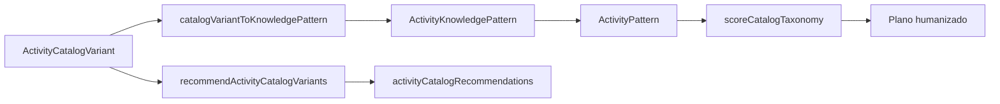

# Integracao do Catalogo com o Motor

## Objetivo

Documentar como o catalogo alimenta o motor atual sem abrir nova arquitetura e sem alterar contrato persistido de rastreabilidade.

## Fluxo atual

## Mapeamento para `ActivityKnowledgePattern`

O catalogo e consumido pelo motor por meio do mapeamento de `ActivityCatalogVariant` para `ActivityKnowledgePattern`.

Contrato minimo:

| Catalogo | Motor |
| --- | --- |
| `variant.id` | `id` |
| `variant.taxonomy.skill` | `skill` |
| `variant.taxonomy.recommendedPhase` | `stage` |
| `variant.taxonomy.ageRange` | `ageStages` |
| `variant.taxonomy.families` | `families` |
| `variant.periodizationFit` | `periodizationFit` |
| campos de execucao | campos operacionais do pattern |
| `variant.taxonomy` | `catalogTaxonomy` |

`catalogTaxonomy` deve acompanhar o pattern para que o score consiga considerar periodizacao, progressao, intencao pedagogica, carga e idade.

## Score do catalogo

`scoreCatalogTaxonomy` deve favorecer, nesta ordem pedagogica:

1. foco da periodizacao diaria ou semanal;
2. `primarySkill` e `secondarySkill`;
3. `progressionDimension`;
4. `pedagogicalIntent`;
5. faixa etaria;
6. carga da sessao;
7. scouting e feedback de relatorio;
8. historico recente e anti-repeticao;
9. materiais e ambiente.

Na engine, a compatibilidade com `periodizationCompatibility` precisa ter peso suficiente para impedir que uma atividade boa, mas fora do foco da semana, supere uma atividade alinhada ao plano.

## Recomendacoes transitórias

`buildAutoPlanForCycleDay` expoe `activityCatalogRecommendations` como resultado transitorio. Essas recomendacoes podem ser usadas por UI futura, debug ou explicabilidade, mas nao alteram o `decisionTrace` persistido.

Cada recomendacao deve conter:

- `variant`
- `score`
- `reasons`

As razoes devem explicar sinais como:

- faixa etaria da turma;
- foco tecnico;
- intencao pedagogica;
- compatibilidade de periodizacao;
- dificuldade recente;
- anti-repeticao;
- materiais disponiveis.

## `decisionTrace`

O contrato persistido permanece com `schemaVersion: 1`.

Enquanto a explicacao do catalogo couber em resultado transitorio, nao adicionar campo persistido novo. Se uma etapa futura exigir persistir influencia do catalogo dentro do `decisionTrace`, essa mudanca deve ser tratada como alteracao de contrato e documentada em PR proprio.

## Hierarquia de verdade

1. Periodizacao e plano do dia.
2. Contexto real da turma.
3. Scouting, historico e feedback de relatorio.
4. Catalogo pedagogico.
5. Motor de composicao e validacao.
6. `PedagogicalPlanPackage`.
7. `TrainingPlan.pedagogy.blocks`.

O catalogo melhora a selecao, mas nao substitui o plano periodizado nem a confirmacao do professor.
