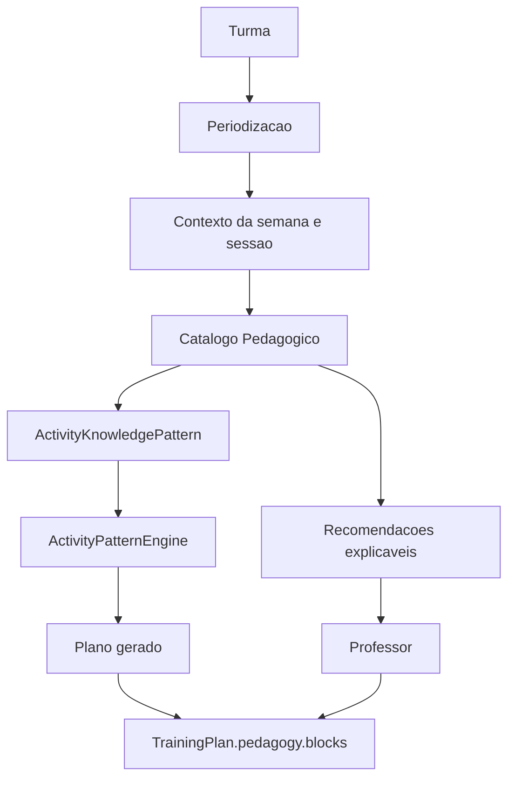

# Catalogo Pedagogico do GoAtleta

## Objetivo

Este pacote documenta como manter e evoluir o Catalogo Pedagogico do voleibol no GoAtleta.

O catalogo nao e uma lista solta de exercicios. Ele e a camada explicita de conhecimento pedagogico usada para orientar selecao, ranqueamento, explicacao e revisao de atividades.

## Filosofia

O fluxo correto de geracao deve permanecer ancorado nesta cadeia:

```txt
Turma
-> Periodizacao
-> Objetivo da semana
-> Objetivo da aula
-> Contexto da turma
-> Restricoes
-> Catalogo pedagogico
-> Escolha de padroes
-> Blocos pedagogicos
```

O catalogo estabiliza essa cadeia porque transforma conhecimento antes implicito no motor em familias pedagogicas auditaveis.

## Principios

- A aula aplicada deve convergir para `TrainingPlan.pedagogy.blocks`.
- Campos legados como `warmup`, `main` e `cooldown` seguem como compatibilidade e renderizacao, nao como fonte semantica principal.
- O catalogo fica em TypeScript nesta fase.
- Nao criar migration, tabela Supabase ou persistencia propria do catalogo.
- O `decisionTrace` persistido deve preservar `schemaVersion: 1`.
- Recomendacoes do catalogo podem ser transitórias e explicaveis, mas nao devem sobrescrever o plano sem acao do professor.
- A biblioteca visual sera consumidora futura do mesmo catalogo, nao outra fonte pedagogica.

## Arquitetura



## Mapa dos documentos

| Documento | Funcao |
| --- | --- |
| `CATALOG_GUIDE.md` | Contrato do catalogo TypeScript e regras de extensao |
| `ENGINE_INTEGRATION.md` | Ponte catalogo -> `ActivityKnowledgePattern` -> engine -> auto-plan |
| `TESTS.md` | Testes, comandos e troubleshooting |
| `QA_CHECKLIST.md` | Criterios de aceite pedagogico e tecnico |
| `PR_GUIDE.md` | Roteiro de PR pequeno e revisao |
| `EXAMPLES.md` | Exemplos originais e snippets alinhados ao estado local |
| `activity-catalog-usage-audit.md` | Auditoria derivada de cobertura e uso real do catalogo |
| `media/activity-catalog-media-manifest.v2.json` | Manifest auditavel dos thumbnails locais do catalogo |
| `media/prompts/activity-catalog-thumbnails-v2.md` | Prompts versionados para assets visuais do catalogo |
| `media/providers/higgsfield.md` | Regras para usar Higgsfield como provider opcional, fora do runtime |

## Fora de escopo desta etapa

- Nova tela de biblioteca.
- Persistencia do catalogo.
- Tabela Supabase.
- Fluxo Vercel ou deploy.
- Expansao massiva de exercicios.
- Mudanca de contrato persistido do `decisionTrace`.

## Regra final

Quando houver conflito entre este pacote e o codigo local, o codigo local e os testes do core sao a fonte de verdade. Este pacote deve ser atualizado junto com qualquer mudanca futura em `ActivityCatalogTaxonomy`, no mapeamento para `ActivityKnowledgePattern` ou na explicabilidade do gerador.
